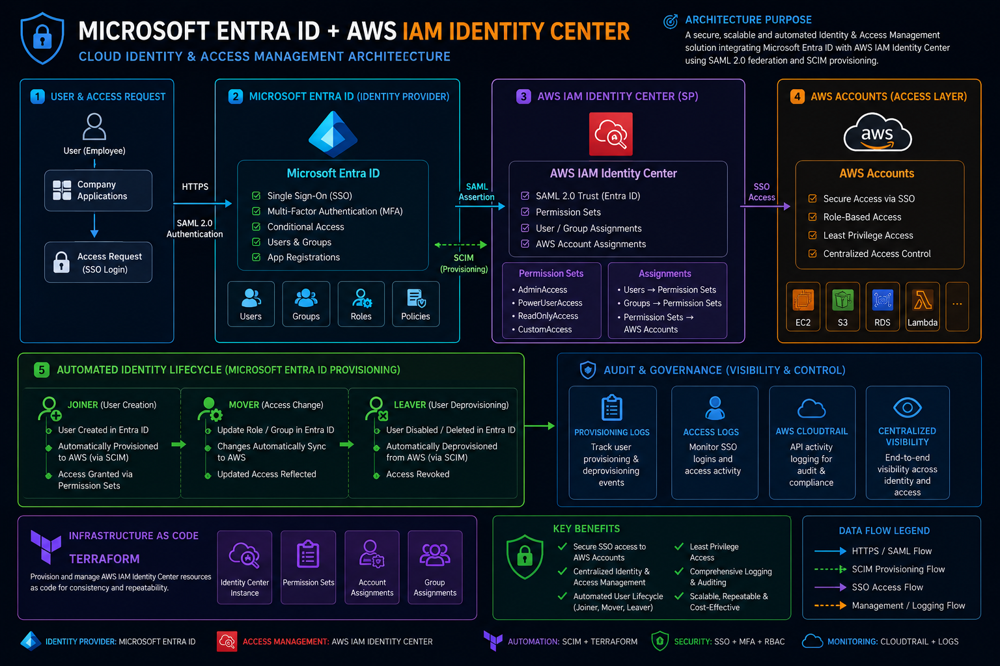
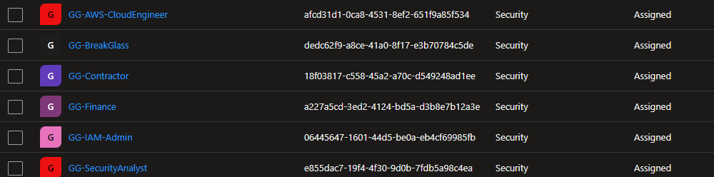
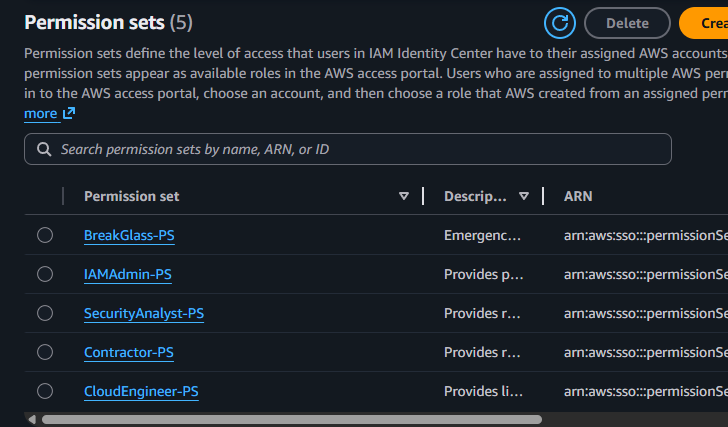
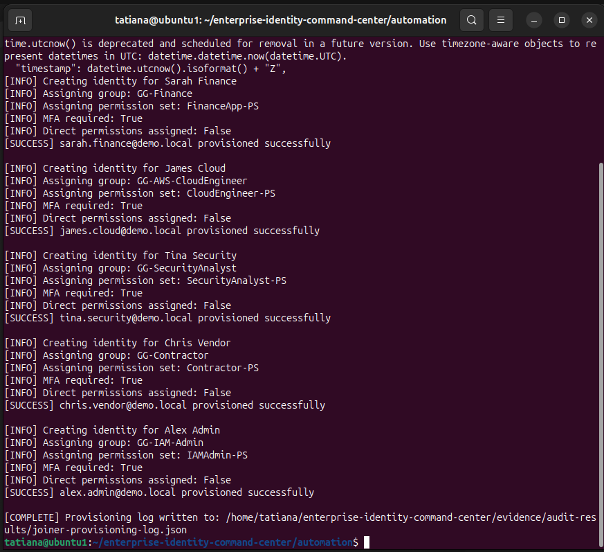
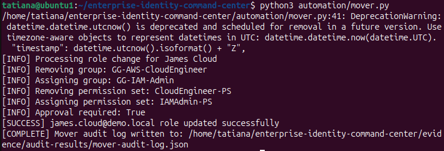
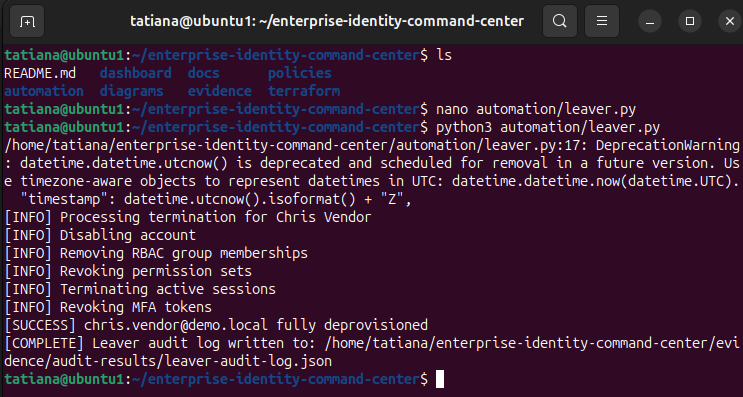
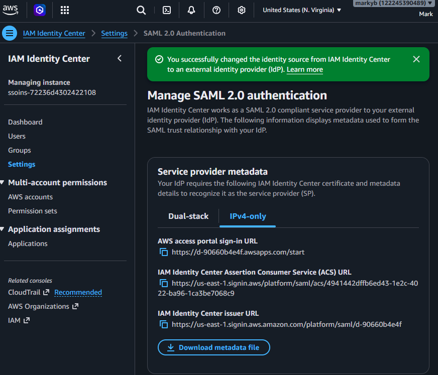
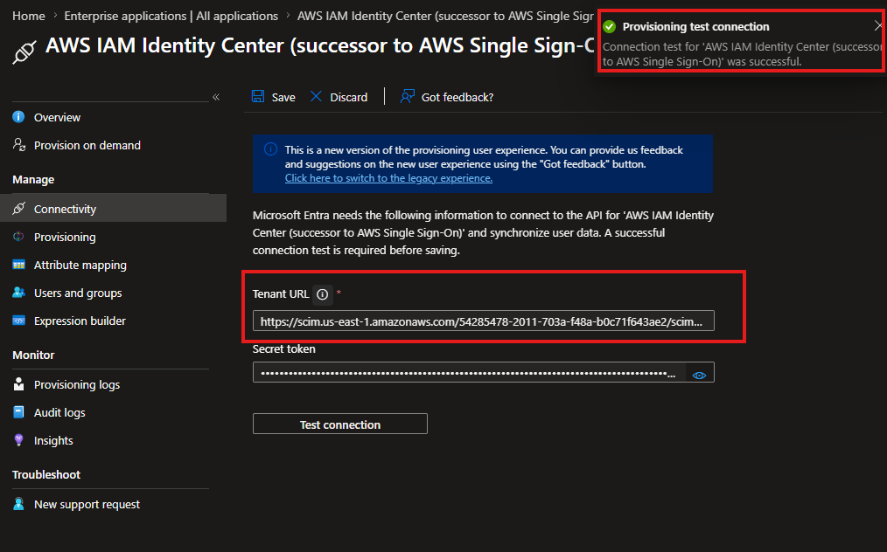
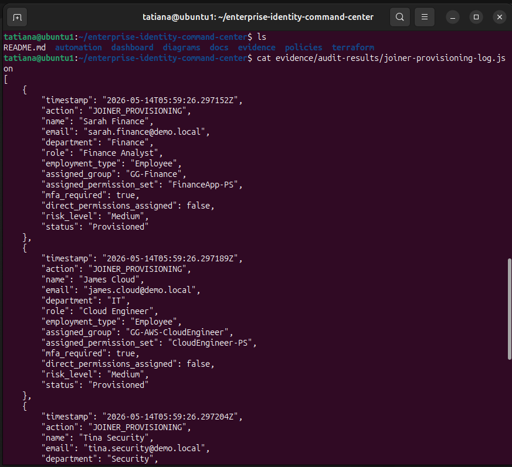
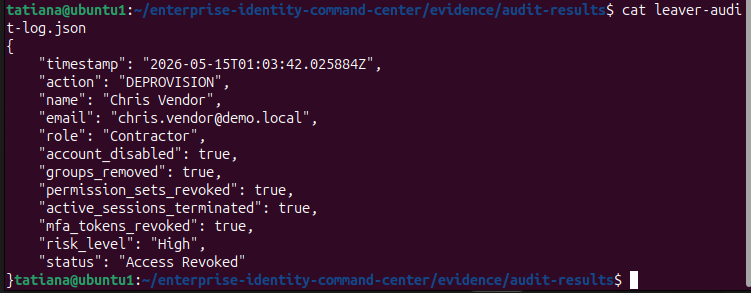

# Enterprise Identity Command Center

## Senior-Level IAM Architecture, Federation, Governance, and Lifecycle Automation Project

---

# Overview

Enterprise Identity Command Center is a senior-level Identity and Access Management (IAM) architecture project designed to simulate how mature enterprises manage workforce identity, federated authentication, cloud authorization, RBAC governance, privileged access, and lifecycle automation across hybrid cloud environments.

The project focuses on:

* Centralized identity management
* SAML federation
* SCIM provisioning
* RBAC governance
* Identity lifecycle automation
* Least privilege enforcement
* Privileged access management concepts
* Audit logging and operational visibility
* Cloud identity integration with AWS IAM Identity Center
* Enterprise IAM documentation and governance standards

The environment was intentionally designed around enterprise IAM methodologies rather than basic account administration.

---

# Business Problem

Modern enterprises face several major IAM challenges:

* Identity sprawl across cloud environments
* Manual provisioning and deprovisioning
* Excessive permissions and privilege creep
* Inconsistent RBAC governance
* Weak MFA enforcement for privileged accounts
* Lack of centralized identity governance
* Poor auditability and lifecycle tracking

This project was designed to simulate how enterprise IAM teams solve these problems through centralized identity, federation, governance, and lifecycle automation.

---

# Architecture Overview

The following diagram illustrates the end-to-end enterprise Identity and Access Management (IAM) architecture integrating Microsoft Entra ID with AWS IAM Identity Center using SAML federation, SCIM provisioning, RBAC governance, permission sets, and automated lifecycle management workflows.

The environment was designed around Zero Trust principles, centralized identity governance, least privilege access control, and enterprise cloud authorization methodologies.



## Core Components

| Component               | Purpose                                        |
| ----------------------- | ---------------------------------------------- |
| Microsoft Entra ID      | Centralized enterprise identity provider       |
| AWS IAM Identity Center | Federated AWS access management                |
| SAML Federation         | Centralized SSO and authentication             |
| SCIM Provisioning       | Automated identity synchronization             |
| Permission Sets         | RBAC-based AWS authorization                   |
| Python Automation       | Joiner/Mover/Leaver workflows                  |
| Audit Logging           | Governance visibility and operational evidence |
| RBAC Governance         | Group-based access control                     |

---

# Identity Architecture

```text
User
↓
Microsoft Entra ID
↓
Governance Groups (RBAC)
↓
AWS IAM Identity Center
↓
Permission Sets
↓
Federated AWS Access
```

---

# Enterprise IAM Design Decisions

## Centralized Identity

Microsoft Entra ID was selected as the primary identity provider to simulate a realistic enterprise workforce identity environment.

Benefits:

* Centralized authentication
* Consistent MFA governance
* Reduced identity sprawl
* Simplified lifecycle management
* Centralized RBAC administration

---

## Group-Based Access Control

The project intentionally prohibits direct user permissions.

Instead:

```text
Users
→ Governance Groups
→ Permission Sets
→ Cloud Access
```

Benefits:

* Simplified governance
* Improved auditability
* Easier access reviews
* Reduced privilege inconsistency
* Better lifecycle management





---

## Least Privilege Enforcement

Access was intentionally separated based on business role and risk level.

Examples:

| Role                 | Access Model                         |
| -------------------- | ------------------------------------ |
| Cloud Engineers      | PowerUser cloud engineering access   |
| Security Analysts    | Security visibility and audit access |
| IAM Admins           | Elevated IAM administration          |
| Contractors          | Restricted read-only visibility      |
| Break Glass Accounts | Emergency-only privileged access     |

---

# Lifecycle Automation

## Joiner Workflow

The Joiner automation simulates HR-driven onboarding.

Capabilities:

* Reads HR identity dataset
* Maps users to RBAC groups
* Assigns permission sets
* Enforces MFA requirements
* Generates audit logs


---

## Mover Workflow

The Mover workflow simulates role transitions and access governance.

Capabilities:

* Removes old RBAC assignments
* Assigns new groups and permission sets
* Recalculates risk level
* Generates governance audit evidence


---

## Leaver Workflow

The Leaver workflow simulates enterprise deprovisioning.

Capabilities:

* Disables accounts
* Revokes permission sets
* Removes group memberships
* Terminates active sessions
* Revokes MFA tokens
* Generates audit evidence


---

# SAML Federation

The project implements SAML federation between Microsoft Entra ID and AWS IAM Identity Center.

Federation capabilities:

* Centralized authentication
* Federated AWS access
* Reduced cloud-native identity sprawl
* Enterprise SSO architecture
* Centralized access governance

---

# SCIM Provisioning

The project implements SCIM provisioning between Entra ID and AWS IAM Identity Center.

Capabilities:

* Automated identity synchronization
* Automated lifecycle provisioning
* Centralized RBAC synchronization
* Reduced manual administration

Note:

Group assignment provisioning was partially limited by Microsoft Entra licensing constraints in the lab environment. Architectural design and provisioning workflows were still fully implemented and documented.


---

# AWS Permission Sets

| Permission Set     | Purpose                         |
| ------------------ | ------------------------------- |
| CloudEngineer-PS   | Cloud engineering operations    |
| SecurityAnalyst-PS | Security audit visibility       |
| IAMAdmin-PS        | IAM administration              |
| Contractor-PS      | Restricted contractor access    |
| BreakGlass-PS      | Emergency administrative access |

---

# Governance Groups

| Governance Group     | Purpose                       |
| -------------------- | ----------------------------- |
| GG-AWS-CloudEngineer | Cloud engineering access      |
| GG-SecurityAnalyst   | Security visibility access    |
| GG-IAM-Admin         | Privileged IAM administration |
| GG-Finance           | Finance application access    |
| GG-Contractor        | Restricted contractor access  |
| GG-BreakGlass        | Emergency privileged access   |

---

# Security Principles Implemented

* Least privilege access
* RBAC governance
* Federated authentication
* Centralized identity management
* Privileged access separation
* MFA architectural enforcement planning
* Audit logging
* Lifecycle governance
* Operational visibility
* Identity standardization

---

# Audit and Governance

The environment generates structured audit evidence for:

* User provisioning
* Role transitions
* Access revocation
* Permission assignment
* Lifecycle events
* Governance workflows

Audit artifacts include:

* JSON audit logs
* RBAC matrices
* IAM standards
* Architecture decision records
* Federation configuration evidence
* Lifecycle workflow screenshot




---

# Tools and Technologies

| Technology              | Purpose                      |
| ----------------------- | ---------------------------- |
| Microsoft Entra ID      | Enterprise identity provider |
| AWS IAM Identity Center | Federated cloud access       |
| SAML 2.0                | Authentication federation    |
| SCIM v2.0               | Identity provisioning        |
| Python                  | Lifecycle automation         |
| Git/GitHub              | Version control              |
| Linux (Ubuntu)          | Engineering environment      |
| AWS IAM                 | Cloud authorization          |

---

# Key Skills Demonstrated

## IAM Engineering

* Identity federation
* RBAC implementation
* Lifecycle automation
* Permission governance
* Identity architecture
* Cloud authorization
* SCIM provisioning
* SAML federation

## Cloud Security

* AWS IAM Identity Center
* Permission sets
* Least privilege
* Federated access
* Governance-based authorization

## Security Governance

* IAM standards
* Architecture decision records
* Audit logging
* Operational visibility
* Risk-based access design

## Engineering and Operations

* Python automation
* Git version control
* Linux troubleshooting
* Identity troubleshooting
* Operational workflow management

---

# Lessons Learned

This project reinforced several important enterprise IAM concepts:

* Federation and provisioning are separate identity functions
* Centralized identity simplifies governance and lifecycle management
* Group-based RBAC scales better than direct permissions
* IAM engineering requires both architecture planning and operational troubleshooting
* Auditability and lifecycle governance are critical for enterprise security
* Real-world IAM implementations often involve licensing and integration constraints that require adaptive engineering decisions

---

# Planned Future Enhancements

* Conditional Access MFA enforcement
* Privileged Access Management (PAM) integration
* CloudTrail logging integration
* Automated access reviews
* Terraform infrastructure-as-code deployment
* Advanced least privilege custom policies
* Access certification workflows

---

# Final Summary

Enterprise Identity Command Center was designed to simulate how mature enterprises manage workforce identity, cloud federation, RBAC governance, lifecycle automation, and access governance at scale.

The project combines identity architecture, security governance, lifecycle automation, cloud authorization, and operational visibility into a unified IAM engineering environment that reflects modern enterprise identity management practices.
